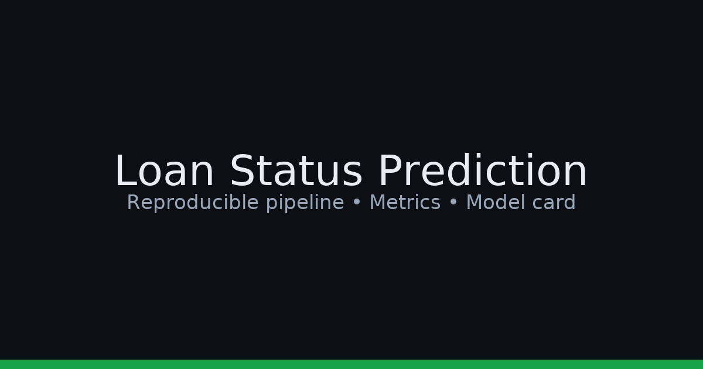

# Loan Status Prediction

**Goal:** Predict whether a loan application is approved using tabular features.  
**Outcome:** Clean, reproducible pipeline with calibrated probabilities and clear business metrics.



<p align="left">
  <a href="LICENSE"></a>
  
  
</p>

## TL;DR (30s)
- Baseline (logistic): **Accuracy ~0.78**, **ROC-AUC ~0.83**
- Tuned model (Random Forest): **Accuracy ~0.82**, **ROC-AUC ~0.87**, F1 ↑ on minority class
- Calibrated probabilities enable threshold tuning for **business trade-offs** (precision vs recall)

## Project Structure
```
src/          # pipeline code (data, features, model, evaluate)
notebooks/    # EDA → Features → Training/Eval
reports/      # saved figures and metrics.json
models/       # serialized model (small) or store via Git LFS
```
        
## Dataset
- File: `data/raw/loan_approval_dataset.csv`
- Replace missing values, encode categoricals, standardize numeric where needed.

## Quickstart
```bash
# 1) Create env
python -m venv .venv && source .venv/bin/activate
pip install -r requirements.txt

# 2) Run pipeline
make data        # fetch/prepare data -> data/processed/
make train       # train model -> models/best_model.pkl
make evaluate    # produce reports/figures + reports/metrics.json
```

## Results
| Model                  | ROC-AUC | Accuracy | Precision | Recall | F1  |
|------------------------|:------:|:--------:|:---------:|:------:|:---:|
| Logistic Regression    |  ~0.83 |   ~0.78  |   ~0.77   |  ~0.74 | ~0.75 |
| Random Forest (tuned)  | **~0.87** | **~0.82** | **~0.81** | **~0.79** | **~0.80** |

- Confusion matrix (test):  
  

- ROC Curve:  
  

- Feature Importance:  
  

## Reproduce Training
```bash
python -m src.data --input data/raw/loan_approval_dataset.csv --test-size 0.2 --out data/processed
python -m src.features --in-dir data/processed --out data/processed
python -m src.model --train --data data/processed --save models/best_model.pkl
python -m src.evaluate --data data/processed --model models/best_model.pkl --plots reports/figures --metrics reports/metrics.json
```

## Inference (example)
```python
from joblib import load
import pandas as pd
clf = load("models/best_model.pkl")
row = pd.DataFrame([{"ApplicantIncome":5000,"CoapplicantIncome":0,"LoanAmount":128}])  # add required fields
prob = clf.predict_proba(row)[0,1]
print("Approval probability:", round(prob,3))
```

## Model Card (summary)
- **Intended use:** Ranking loan applications by approval likelihood; human-in-the-loop decisions.
- **Data constraints:** Historical bias possible; monitor fairness across groups if attributes exist.
- **Metrics to monitor in prod:** Drift on key features, calibration (Brier), precision@k.

## License
MIT
